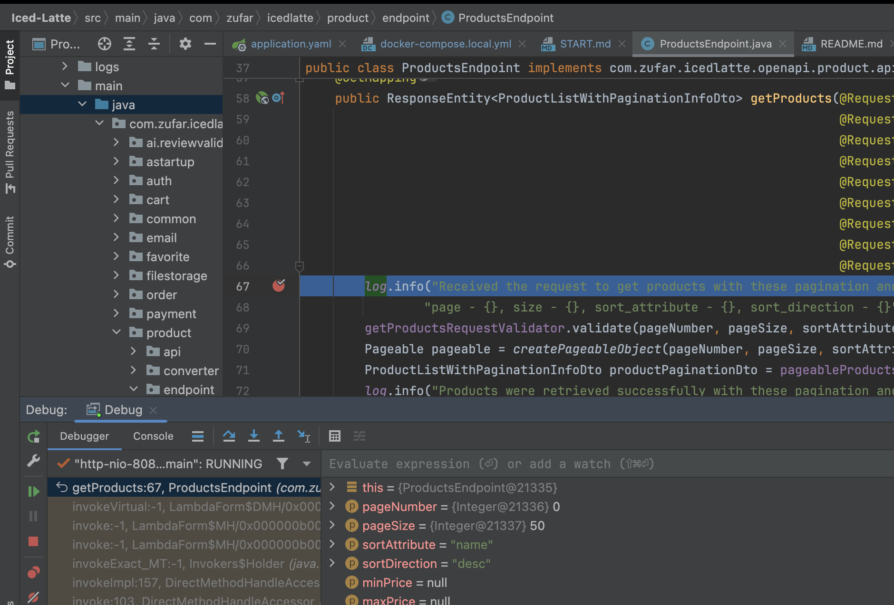

# Getting Started with the Iced Latte

Welcome to the Iced Latte! 
This guide will assist you in setting up and running the application using Docker and Docker Compose.

## Prerequisites

Ensure you have Docker Desktop installed.

## Configuration

Key variables which are used in the startup of the app. They are pre-configured for initial use, can be adjusted to tailor the app's startup settings.
- `APP_PROFILE`: Application profile (e.g., `dev`)
- `APP_VERSION`: Application version
- `APP_SERVER_PORT`: Server port for the backend service
- `DATASOURCE_URL`: JDBC URL for the PostgreSQL database
- `DATASOURCE_PORT`: Database port
- `DATASOURCE_NAME`: Database name
- `DATASOURCE_USERNAME`: Database username
- `DATASOURCE_PASSWORD`: Database password
- `REDIS_HOST`: Redis host
- `REDIS_PORT`: Redis port
- `AWS_ACCESS_KEY` AWS access key
- `AWS_SECRET_KEY` AWS secret key
- `AWS_REGION` AWS region
- `AWS_PRODUCT_BUCKET` AWS product's bucket name
- `AWS_USER_BUCKET`  AWS product's bucket name
- `AWS_DEFAULT_PRODUCT_IMAGES_PATH` Package with product's files 
- `STRIPE_SECRET_KEY` Stripe secret key for payment integration

Refer to [docker-compose.local.yml](./docker-compose.local.yml)

## Starting the Application

### Running All Services with latest build
To start the application containers with the latest build:
```bash
docker-compose -f docker-compose.local.yml up -d --build
```

### Running All Services

To start both the backend and PostgreSQL database services as defined in the `docker-compose.yml` file:

```bash
docker-compose -f docker-compose.local.yml up -d
```

### Running only a Database (postgresql)
To start only the PostgreSQL database as defined in the docker-compose.local.yml file:
```bash
docker-compose -f docker-compose.local.yml up -d iced-latte-postgresdb
```

## Additional Docker Commands

### Rebuild containers after changes
```bash
docker-compose -f docker-compose.local.yml build
```
### Stopping Services
To stop all running containers:
```bash
docker-compose -f docker-compose.local.yml down
```

### Viewing Logs
To view logs for a specific service:
```bash
docker-compose -f docker-compose.local.yml logs [iced-latte-backend|iced-latte-postgresdb] [-f]
```

### Remove all volumes (including database data):
```bash
docker-compose -f docker-compose.local.yml down -v
```

### Remote Debugging (e.g. in Docker)
If you want to debug BE application running in Docker, use **Remote JVM Debug** configuration:
1. Double press **Shift**
2. Type `Edit Configurations`
3. Click `+` and select `Remote JVM Debug`
4. Select **Attach to Remote JVM**, make sure that port is `5005` and host is `localhost`
5. Save configuration and click debug button
6. Start containers as usual `docker compose -f docker-compose.local.yml up -d --build`
7. Set a breakpoint, e.g. here [ProductsEndpoint#getProducts](src/main/java/com/zufar/icedlatte/product/endpoint/ProductsEndpoint.java#L67)
8. Try it out:

    ```bash
    curl -X 'GET' \
    'http://localhost:8083/api/v1/products?page=0&size=50&sort_attribute=name&sort_direction=desc' \
    -H 'accept: application/json'
    ```

Enjoy!



### Local Frontend + Backend
To run FE and BE locally for testing purposes:
1. Check out [Iced Latte Frontend](https://github.com/Sunagatov/Iced-Latte-Frontend/) repo
2. Navigate to the root of FE repo and create `.env`: ```bash echo 'NEXT_PUBLIC_API_HOST_REMOTE=http://localhost:80/backend/api/v1' > .env```
3. Uncomment `iced-latte-frontend.build` section in [docker-compose.local.yml](./docker-compose.local.yml#L18)
4. Set path to local FE repo in `iced-latte-frontend.build.context`
5. Run build as usual
```bash
docker compose -f docker-compose.local.yml up -d --build
```

* FE is here http://localhost/
* BE is here http://localhost/backend (e.g. http://localhost/backend/api/v1/products) and here too http://localhost:8083

:warning: **Limitations**:

AWS is available only in production, therefore there are no real pictures of products, only stubs.

## Database Navigator

> For Ultimate Edition consider using [Database Tools and SQL plugin](https://www.jetbrains.com/help/idea/relational-databases.html)

Install [Database Navigator](https://plugins.jetbrains.com/plugin/1800-database-navigator).

Go to **View** > **Tool Windows** > **DB Browser**.

Add new PostgresSQL connection:
 * Host `127.0.0.1`
 * Database `testdb`
 * User `postgres`
 * Password `postgres`

Enjoy!

